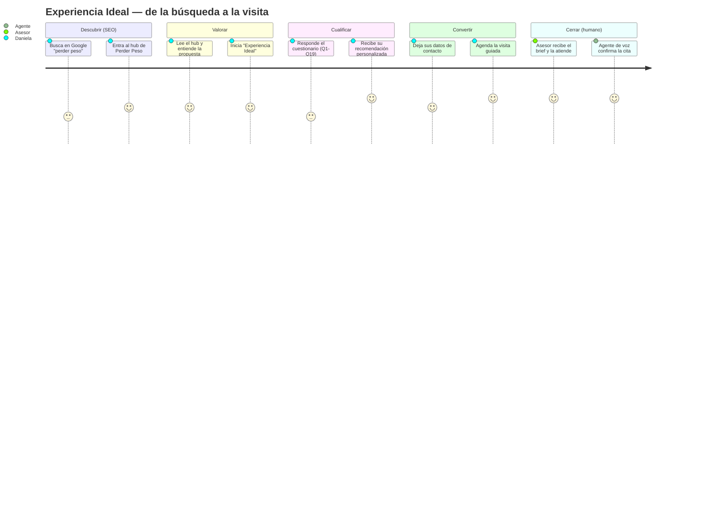
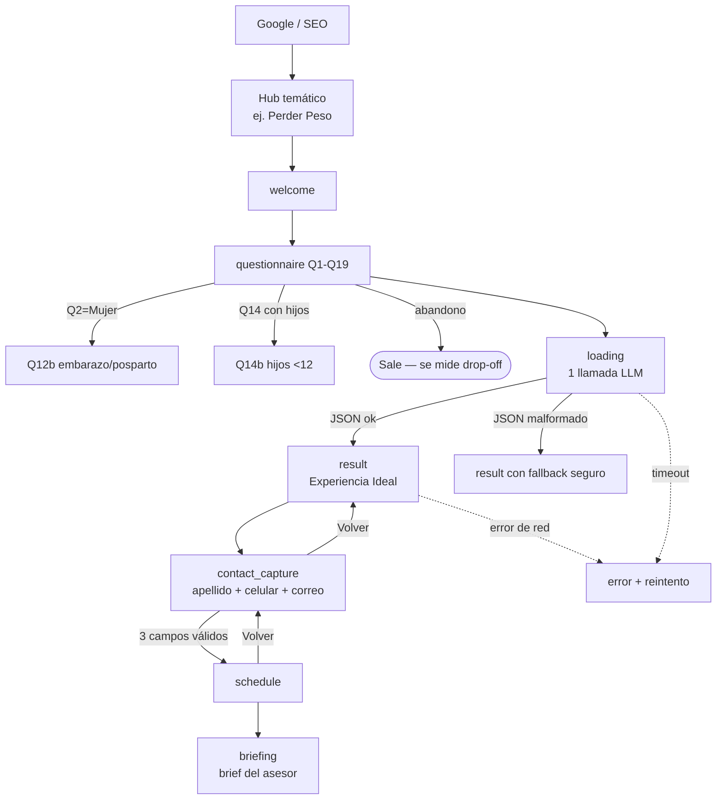

# UX Spec — Experiencia Ideal (captación de leads + SEO) · Sports World

| Campo | Valor |
|---|---|
| Versión | v1.0 (derivada y corregida de 01_UX_Specification_v4_2_10.docx) |
| Fecha | 2026-06-10 |
| Autores | Producto · Diseño · Ingeniería · QA (coautoría pendiente de firma) |
| Estado | En revisión |
| Stack de salida | React + Tailwind `[SUPUESTO — el demo usa estilos en línea; confirmar tokens en Tailwind]` |
| Herramienta de handoff | `[POR DEFINIR — enlazar Figma inspect / Zeplin]` |
| Fuente única de verdad (datos/reglas) | sw_experiencia_ideal_demo_v6_FINAL.jsx + este documento |

> **Nota de método.** Este documento reescribe el spec de ingeniería previo (Parts 1–6 + Appendices A–H) bajo el estándar `ux-spec`: el *porqué* antes que el *qué*, accesibilidad legal preventiva, tokens legibles por máquina y mecánicas de conversión. Las reglas técnicas detalladas (contraindicaciones YMYL, esquema del LLM, brief del asesor) siguen vigentes y se referencian; aquí se añaden las capas de racionalidad, journey, tokens, accesibilidad, conversión, aceptación y métricas que faltaban.

---

## 1. Racionalidad del Diseño (Design Rationale)

### 1.1 Cadena de razonamiento (Por qué → Quién → Qué → Cómo)

- **Por qué (meta SMART).** Duplicar el tráfico orgánico del sitio: pasar de **80,000 a 160,000 visitas mensuales en 3 meses**, haciendo el sitio mucho más encontrable en Google mediante una estrategia SEO aplicada a una **nueva estructura de hubs y paginación**. Palanca de ejemplo: un **hub de "perder peso"** captura una de las búsquedas de mayor volumen en México y, por sí solo, tiene potencial de duplicar el tráfico.
  - **Meta secundaria:** duplicar (**2x**) el número de **leads cualificados** que llegan al asesor.
  - **Meta terciaria:** reducir el **tiempo de respuesta al cliente** mediante el **agente de voz** (atención inmediata 24/7).
- **Quién (actores).**
  - *Primario:* persona en México que busca en Google ("cómo perder peso", "gimnasio cerca de mí", "ganar masa muscular") y aterriza en un hub.
  - *Secundario:* el **Advisor** (ventas) que recibe el brief y agenda la visita guiada; el **agente de voz** que responde y coordina.
  - *Fuera de escena:* entrenadores que definen ejercicios en la primera sesión; equipo de marketing/SEO que gobierna los hubs.
- **Qué (comportamiento medible / Jobs to be Done).** El visitante debe: **encontrar** el sitio en Google → **completar** el cuestionario Experiencia Ideal → **dejar** sus datos de contacto → **agendar** la visita guiada. Se mide con: tráfico orgánico, tasa de finalización del cuestionario, leads cualificados y tiempo de primera respuesta.
- **Cómo (táctica/UI).** Arquitectura de **hubs SEO** (páginas indexables de alto volumen) que alimentan el flujo **Experiencia Ideal**: un cuestionario guiado de 19 preguntas que entrega una recomendación personalizada (Bloque 1 pesas · Bloque 2 cardio · Bloque 3 clases) + captura de contacto + brief para el asesor + agente de voz.

### 1.2 Justificación macro (estrategia de negocio)

El motor de crecimiento es **SEO de estructura**, no publicidad pagada. Hoy el sitio recibe 80,000 visitas/mes; el techo está limitado por la **arquitectura de información**: pocas páginas indexables apuntando a búsquedas de alto volumen. La nueva estructura crea **hubs temáticos** (perder peso, masa muscular, salud cardiovascular, etc.) y **páginas paginadas** de clubes/clases, multiplicando la superficie indexable y la relevancia. Cada hub es a la vez una **puerta de entrada SEO** y el inicio del **embudo de conversión** (Experiencia Ideal). Así, el mismo cambio estructural sirve a las tres metas: más tráfico, más leads cualificados y respuesta más rápida.

### 1.3 Justificación micro (decisiones puntuales)

| Decisión | Por qué esta y no otra |
|---|---|
| **Cuestionario único guiado** (19 preguntas) en vez de formulario corto | Es una **herramienta interactiva de valor** (calculadora de "experiencia ideal"): el usuario entrega datos a cambio de una recomendación personalizada, lo que mitiga el rebote de los formularios largos. *Riesgo:* sigue siendo largo → se mide abandono por pregunta (ver §10) y se evalúa perfilado progresivo si el abandono supera el umbral. |
| **Rojo de marca `#E6282A`** reservado a CTA y acentos | Señala acción/conversión; nunca se usa en bloques de texto para no diluir la jerarquía. |
| **Tres bloques de color** (azul/verde/gris) para la recomendación | Segmentan cognitivamente los tres componentes del entrenamiento; reducen carga al separar "qué hago con pesas / cardio / clases". |
| **Captura de contacto DESPUÉS del resultado** | El usuario ya recibió valor (su recomendación); pedir datos en ese momento maximiza la conversión y la calidad del lead. |
| **Lenguaje accesible, sin jerga** ("crecimiento muscular", no "hipertrofia") | El público objetivo no es experto; la jerga aliena y reduce conversión (ver `ux-writing`). |
| **Nombres de subgrupo orientados a objetivo** (6) en vez de nomenclatura ACSM | El usuario se reconoce en su meta ("Bajar de peso"), no en un término técnico de fisiología. |

---

## 2. Personas y Customer Journey

### 2.1 Personas

**P1 — Daniela, 34, busca bajar de peso (primaria).**
Busca en Google desde el celular "cómo bajar de peso rápido" o "gimnasio cerca de casa". Contexto: poco tiempo, algo intimidada por el gym. Meta: verse y sentirse mejor. Frustración: no sabe por dónde empezar ni si un gimnasio es para ella. **Gatillo de conversión:** una recomendación clara y sin juicio + una visita guiada.

**P2 — Marco, 27, quiere ganar masa muscular (primaria).**
Intermedio, viene de otro gimnasio. Busca "rutina masa muscular" / "mejor gimnasio". Quiere progreso medible y equipo. Frustración: planes genéricos. **Gatillo:** ver que la recomendación se adapta a su nivel.

**P3 — Asesor de ventas (secundaria, interna).**
Recibe el **brief** con el perfil del lead y sus banderas (principiante, embarazo, lesión, GLP-1, familia con hijos). Meta: convertir la visita en membresía sin re-preguntar lo ya respondido. Frustración: leads fríos o sin contexto.

**P4 — Agente de voz (secundaria, sistema).**
Atiende y coordina 24/7. Meta: responder al instante y agendar; transferir a humano cuando no comprende.

### 2.2 Customer Journey (de Google a la membresía)

---

## 3. Flujos y Diagrama de Transición

Todas las bifurcaciones (no solo el camino feliz). Fases del sistema: `welcome · questionnaire · loading · result · contact_capture · schedule · briefing · error`.

**Filtro de seguridad (YMYL):** antes de construir el Bloque 3 (clases), el motor aplica el **filtro duro de contraindicaciones** (5 condiciones: lesión, cardiovascular, embarazo, posparto, bariátrica). Las clases contraindicadas nunca aparecen. Detalle completo en el documento técnico (Rule 14b). 

---

## 4. Especificación por Pantalla / Componente

### 4.1 Hub temático SEO (ej. `/perder-peso`)

- **Propósito:** captar tráfico orgánico de alta intención y enrutarlo a Experiencia Ideal.
- **Layout y dimensiones:** grid de 12 columnas; contenedor máx. 1200px; padding 16px móvil / 24px desktop; breakpoints 360 / 768 / 1024 / 1440px.
- **Contenido SEO (mínimo por hub):** H1 con la keyword principal; 600–900 palabras de texto útil; FAQ con `schema.org/FAQPage`; enlaces internos a clubes y clases relacionadas; CTA "Descubre tu experiencia ideal".
- **Metadatos:** `<title>` ≤ 60 car., `meta description` ≤ 155 car., canonical, Open Graph; `lang="es-MX"`.
- **Paginación:** listados de clubes/clases con `rel=next/prev` lógico y URLs limpias `/clubes/cdmx/pagina-2`; evita contenido duplicado con canonical.
- **CTA principal:** botón rojo `#E6282A` → inicia `welcome`.
- **Requisito no funcional:** **LCP < 2.5 s**, **CLS < 0.1**, **INP < 200 ms** (Core Web Vitals — afectan ranking SEO).

### 4.2 Cuestionario (`questionnaire`, Q1–Q19)

- **Propósito:** cualificar y personalizar; recolectar los datos del lead.
- **Estructura:** 16 preguntas base (Q1–Q16) + condicionales **Q11** (pausa), **Q12b** (embarazo/posparto, si Q2=Mujer), **Q14b** (hijos <12) + optativas de peso **Q17–Q19**.
- **Un paso por pantalla**, barra de progreso, botón "Continuar" deshabilitado hasta responder.
- **Estados interactivos:** opción `default / hover / focus-visible / selected / disabled`; botón `default / hover / active / disabled / loading`.
- **Validación inline (en tiempo real):**
  - Q1 Nombre: requerido, ≥ 2 caracteres.
  - Q8 días / Q7 horarios: multiselección, ≥ 1.
  - Q16 CP **o** zona (XOR): CP = 5 dígitos numéricos.
- **Contenido (UX writing):** preguntas en español MX, voz activa, sin jerga. Concordancia de género si Q2=Mujer (Q3, Q13, Q14).
- **Requisito no funcional:** transición entre preguntas < 100 ms; estado persistido en cliente para no perder respuestas al recargar.

### 4.3 Resultado — Experiencia Ideal (`result`)

- **Propósito:** entregar la recomendación personalizada (el "valor" a cambio de los datos).
- **Arquitectura visual:** barra superior roja 4px `#E6282A`; 4 tarjetas resumen (objetivo, nivel, horario, con quién entrena); banner CTA rosa `#FFF4F4`/borde `#F3B9BC`; 3 tarjetas de bloque (01 azul `#EEF5FF` · 02 verde `#EDF8F1` · 03 gris `#F3F4F6`); sección de seguridad ámbar `#FFF6E7` con copy contextual; nota legal fija.
- **Bloque 1 (pesas):** uno de **6 nombres accesibles** según objetivo Q4; nunca lista equipo ("Tu entrenador define los ejercicios y el peso en la primera sesión").
- **Bloque 2 (cardio):** máquina + duración + ritmo en lenguaje llano ("ritmo conversacional", no "Zone 2").
- **Bloque 3 (clases):** top 2 clases recomendadas tras el filtro de contraindicaciones, o Personal Training como alternativa.
- **Requisito no funcional:** render con datos de fallback si el LLM devuelve JSON inválido (degradación elegante, sin pantalla en blanco).

### 4.4 Captura de contacto (`contact_capture`)

- **Propósito:** convertir el interés en lead contactable. Aparece **entre** `result` y `schedule`; no se puede agendar sin completarla.
- **Encabezado:** "Antes de agendar" · "{Nombre}, necesitamos un par de datos para confirmar tu visita."
- **Campos, validación y errores (verbatim):**

| Campo | Validación | Error inline |
|---|---|---|
| Apellido | `trim().length ≥ 2` | "Ingresa tu apellido (mínimo 2 letras)" |
| Celular | exactamente **10 dígitos** | "Ingresa un número de 10 dígitos" |
| Correo | `/^[^\s@]+@[^\s@]+\.[^\s@]+$/` | "Ingresa un correo electrónico válido" |

- **Privacidad:** "Tus datos se usan únicamente para coordinar tu visita guiada. No los compartimos con terceros."
- **Estados del botón "Continuar":** rojo cuando los 3 campos son válidos; gris deshabilitado en otro caso.
- **Validación en tiempo real:** el error del correo aparece **mientras escribe**, no al enviar.

### 4.5 Agenda y Brief (`schedule`, `briefing`)

- `schedule`: selección de día/hora; "Volver" regresa a `contact_capture`.
- `briefing`: brief del asesor (10 secciones, 5 generadas por el LLM) con banderas de seguridad. Detalle en el documento técnico (Appendix G).

---

## 5. Matriz de Edge Cases y Estados Condicionales

| Condición | Disparador | Comportamiento de la UI | Mensaje |
|---|---|---|---|
| Estado vacío (sin clases válidas) | Todas las clases contraindicadas | Bloque 3 muestra Personal Training como alternativa | "Tu Advisor define el detalle en la visita." |
| Error de servidor / timeout LLM | 5xx o latencia alta | Render con fallback seguro; opción de reintento | "No pudimos generar tu experiencia. Reintentar." |
| JSON malformado del LLM | Parse falla | Página renderiza secciones hardcodeadas; arrays vacíos | — (silencioso) |
| Texto extremadamente largo | Nombre/club muy largos | Wrap + `text-overflow: ellipsis` en chips | — |
| Conexión lenta | Latencia alta | Skeleton en `loading` + spinner; sin bloqueo | — |
| Sin cobertura de club cerca | CP/zona sin club | Muestra otros clubes + nota TooFar | "El club más cercano está a {distancia}." |
| Embarazo / posparto / lesión / bariátrica | Q12/Q12b/Q17 | Filtro duro de clases + mensaje de seguridad | Copy contextual de seguridad (§4.3) |
| FitKidz sin nombres de clase (10 clubes) | Estado B | Sección roja genérica, sin chips | "Tu Advisor te compartirá las actividades para tus hijos." |
| Abandono del cuestionario | Cierra antes de Q19 | Se registra la última pregunta vista | — (evento analítico) |

> Revisado con QA en fase de diseño: **`[POR DEFINIR — agendar revisión con QA]`**.

---

## 6. Sistema de Diseño y Tokens

- **Guía de estilo:** ver `DESIGN.md` (tokens + reglas para agentes de IA).
- **Tokens (DTCG/JSON):** paleta extraída del demo (no inventada):

| Rol | Token | Valor |
|---|---|---|
| Acción / marca | `color.brand.primary` | `#E6282A` |
| Tinta (texto) | `color.text.ink` | `#1D1D1B` |
| Texto secundario | `color.text.muted` | `#6B6B68` |
| Texto deshabilitado | `color.text.disabled` | `#A8A8A6` |
| Borde | `color.border.default` | `#E5E5E3` |
| Superficie | `color.surface.base` | `#F5F5F4` |
| Bloque 01 (pesas) | `color.block.strength` | `#EEF5FF` |
| Bloque 02 (cardio) | `color.block.cardio` | `#EDF8F1` |
| Bloque 03 (clases) | `color.block.classes` | `#F3F4F6` |
| Banner CTA | `color.cta.bannerBg` / `color.cta.bannerBorder` | `#FFF4F4` / `#F3B9BC` |
| Seguridad (YMYL) | `color.safety.bg` | `#FFF6E7` |

- **Componentes/patrones reutilizados:** tarjeta de bloque, tarjeta resumen, chip/pill, banner CTA, sección de seguridad, campo con validación inline, barra de progreso.

---

## 7. Accesibilidad (WCAG 2.1 AA / EAA) — POUR

> Obligación legal (EAA, junio 2025), no opcional. Mapeo preventivo.

### Perceptible
- **Contraste:** validar cada token de texto sobre su fondo ≥ **4.5:1** (texto normal) / **3:1** (grande). Riesgo conocido: rojo `#E6282A` sobre blanco da ~4.0:1 → **no usarlo para texto pequeño**, solo para fondos de botón con texto blanco o para iconografía grande. `[ACCIÓN: validar con linter de contraste]`
- **No solo color:** el estado "seleccionado" de una opción usa **borde + check**, no solo color. La sección de seguridad usa **icono "!" + texto**, no solo el ámbar.
- **Alt text:** toda imagen de hub/club lleva `alt` descriptivo (sintaxis: "{tipo} en {club}, {acción}").

### Operable
- **Tab order** lógico: progreso → opciones → Continuar. Foco visible (`focus-visible` ring de 2px).
- Ningún control depende solo de gesto; multiselección operable por teclado (Espacio/Enter).

### Comprensible
- `lang="es-MX"` declarado. Mensajes de error en voz activa y específicos ("Ingresa un número de 10 dígitos").
- Concordancia de género consistente (Q2=Mujer).

### Robusto
- Cambios dinámicos anunciados con `aria-live="polite"` (confirmación de cita, errores de validación). `role="alert"` en errores de envío.
- Marcado semántico: `<fieldset>/<legend>` por pregunta, `<label>` por campo.

**Checklist por pantalla:** contraste ✔ · alt ✔ · tab order ✔ · foco visible ✔ · idioma ✔ · aria-live ✔ → ejecutar auditoría con plugin antes de front-end.

---

## 8. Handoff y Sincronización

- **Fuente de verdad:** demo `sw_experiencia_ideal_demo_v6_FINAL.jsx` (comportamiento) + este spec (racionalidad) + `DESIGN.md` (tokens). Handoff visual: `[POR DEFINIR — Figma inspect]`.
- **Activos:** iconos vectoriales (SVG), exportables; logotipo "SPORTS WORLD" (peso 800).
- **Riesgo de Design Drift mitigado por:** tokens centralizados (`DESIGN.md`) y componentes respaldados por código (el demo es la referencia funcional).

---

## 9. Criterios de Aceptación

- [ ] Cada hub renderiza H1 con keyword, FAQ con datos estructurados, canonical y metadatos válidos.
- [ ] Core Web Vitals en verde en móvil (LCP < 2.5 s, CLS < 0.1, INP < 200 ms).
- [ ] El cuestionario avanza una pregunta por pantalla; Q11/Q12b/Q14b aparecen solo con su condición.
- [ ] No se puede llegar a `schedule` sin los 3 datos de contacto válidos.
- [ ] El Bloque 3 nunca muestra una clase contraindicada según Q12/Q12b/Q17.
- [ ] Si el LLM falla, la página de resultado renderiza con fallback (sin pantalla en blanco).
- [ ] Todos los textos de error son inline, en voz activa y específicos.
- [ ] Contraste de todos los pares texto/fondo ≥ 4.5:1 (o 3:1 grande), validado por linter.
- [ ] Cambios dinámicos anunciados a lectores de pantalla (aria-live).
- [ ] `lang="es-MX"` declarado en todas las páginas.

---

## 10. Métricas y Experimentación

### 10.1 KPIs

| Métrica | Punto de partida | Meta (3 meses) | Tipo |
|---|---|---|---|
| **Tráfico orgánico mensual** | **80,000 visitas** | **160,000 (2x)** | KPI principal |
| **Leads cualificados / mes** | `[SUPUESTO: 1,000]` | **2x** | Secundario |
| **Tiempo de primera respuesta** (agente de voz) | `[SUPUESTO: horas]` | **< 1 min, 24/7** | Secundario |
| Tasa de finalización del cuestionario | `[SUPUESTO: 40%]` | `[SUPUESTO: ≥ 55%]` | Diagnóstico |
| Tasa de agenda (visita guiada) | `[SUPUESTO: 12%]` | `[SUPUESTO: ≥ 20%]` | Conversión |

> Cifras marcadas `[SUPUESTO]` son de referencia; reemplazar con datos reales de analítica.

### 10.2 Lead scoring y enrutamiento (propuesta — `[SUPUESTO, validar pesos]`)

| Señal (respuesta) | Puntos | 
|---|---|
| Completa contacto + agenda | +40 |
| Q4 = Bajar de peso / Masa muscular (alta intención) | +20 |
| Q10 = Viene de otro gimnasio | +15 |
| Q19 objetivo de cambio definido | +10 |
| Q9 = Avanzado / Intermedio | +5 |
| Solo curioseó, sin agenda | +0 |

| Puntaje | Enrutamiento |
|---|---|
| ≥ 60 | **Lead caliente → asesor + agente de voz al instante** |
| 30–59 | Agenda estándar + recordatorio |
| < 30 | Nurturing por correo / retargeting |

### 10.3 Perfilado progresivo (recomendación)

El cuestionario único es un riesgo de abandono. **Instrumentar drop-off por pregunta**; si Q1→Q19 cae por debajo de `[SUPUESTO: 50%]`, dividir en **2 etapas**: (1) mínimo viable (nombre + objetivo + zona) para dar una recomendación preliminar, (2) detalle antes de agendar.

### 10.4 A/B testing

**No priorizado por ahora** (decisión de negocio). Cuando se active, marcar como variables: titular del hub, copy del CTA ("Agenda tu visita" vs "Descubre tu experiencia ideal"), e imagen hero. Construir estos componentes desde ya como **slots intercambiables** para no rehacer.

---

## Apéndice — Trazabilidad con el documento técnico

Este spec **no reemplaza** las reglas de ingeniería; las ordena bajo el estándar UX. Se conservan y referencian: cuestionario Q1–Q19 (Rule 18/19), modelo de 6 subgrupos (mapeo Q4), filtro de contraindicaciones YMYL (Rule 14b), captura de contacto (Rule 32b), brief del asesor (Appendix G) y llamada única al LLM (Appendix H) del documento `01_UX_Specification_v4_2_10.docx`.
